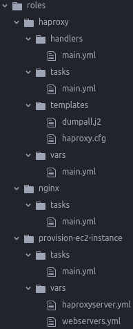

#### Name: Thai Kha le
#### Student ID: 20061112

# Ansible report

Project can be found at https://github.com/thailekha/

# Setup

#### IAM user

Create an IAM user with permission to:
- Full access to ec2
- Readonly access to elasticcache (required by ec2 dynamic inventory)

#### Security group

Allow HTTP and SSH traffic

#### Keypair

Create a keypair and download the pem file

# The Playbook

Index yml files:
- create-infrastructure.yml
  - 
  - Use `provision-ec2-instance` role to create ec2 instances
  - Depending on the var type, this role can setup
    - 2 webservers
    - 1 haproxyserver
- configure-infrastructure.yml
  - 

#### Makefile

Task runner

### Demo

####

### Debug

https://coderwall.com/p/13lh6w/dump-all-variables

### Issues

wrong disk
ssh error: install python: https://github.com/ansible/ansible/issues/25941

run with sudo otherwise will get
fatal: [54.173.237.244]: UNREACHABLE! => {"changed": false, "msg": "Failed to connect to the host via ssh: Warning: Permanently added '54.173.237.244' (ECDSA) to the list of known hosts.\r\nPermission denied (publickey).\r\n", "unreachable": true}
