#### Name: Thai Kha le
#### Student ID: 20061112

# Ansible report

The project can be found at https://github.com/thailekha/ansible-ca

<!-- toc -->

- [Setup](#setup)
    + [IAM user](#iam-user)
    + [Security group](#security-group)
    + [Keypair](#keypair)
    + [EC2 dynamic inventory configuration](#ec2-dynamic-inventory-configuration)
- [The Playbook](#the-playbook)
    + [Root yml files](#root-yml-files)
    + [Nginx role](#nginx-role)
    + [HAProxy role](#haproxy-role)
    + [Makefile](#makefile)
- [Demo](#demo)
    + [Create 2 instances for nginx](#create-2-instances-for-nginx)
    + [Create 1 instance for haproxy](#create-1-instance-for-haproxy)
    + [Install and configure nginx and haproxy on the created instances](#install-and-configure-nginx-and-haproxy-on-the-created-instances)
    + [Browse to the haproxy public ip](#browse-to-the-haproxy-public-ip)
- [Issues encountered](#issues-encountered)
    + [Wrong disk](#wrong-disk)
    + [SSH error of Ubuntu 16](#ssh-error-of-ubuntu-16)
- [Conclusion](#conclusion)

<!-- tocstop -->

# Setup

### IAM user

Create an IAM user with permission to:
- Full access to ec2
- Readonly access to elasticcache (required by ec2 dynamic inventory)

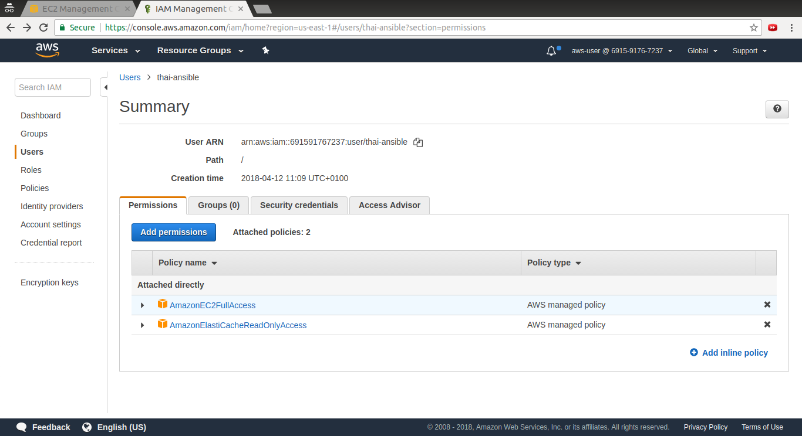

### Security group

Allow HTTP and SSH traffic

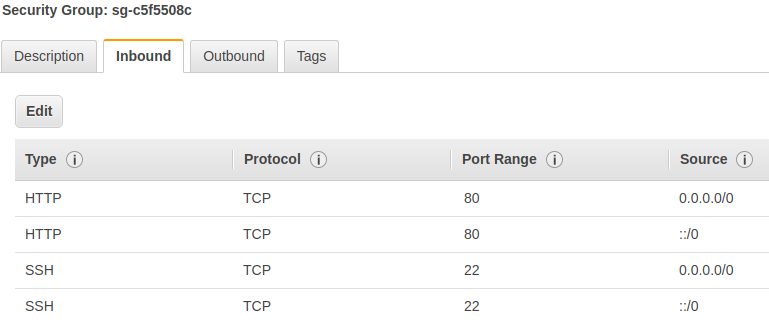

### Keypair

Create a keypair and download the pem file

### EC2 dynamic inventory configuration

The default `ec2.ini` file is used, only the region key is set to `regions = us-east-1`

# The Playbook

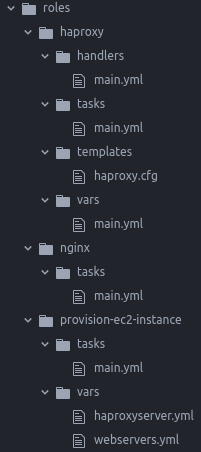

### Root yml files
- `create-infrastructure.yml`
  - 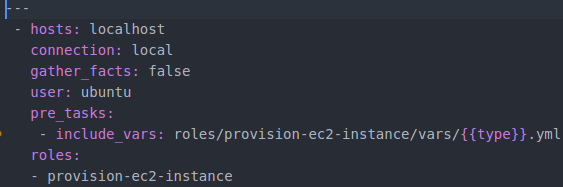
  - Use `provision-ec2-instance` role to create ec2 instances
  - Depending on the `type` var provided when calling ansible (either `haproxyserver` or `webservers`), this role can setup
    - 2 webservers:
     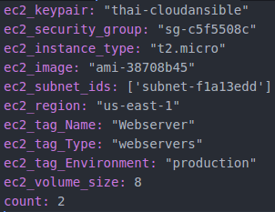
    - 1 haproxyserver:
     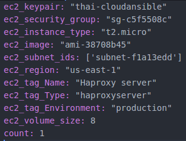
- `configure-infrastructure.yml`
  - 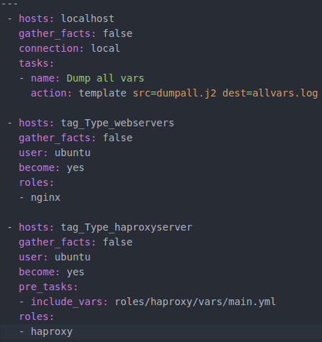
  - `tag_Type_webservers` and `tag_Type_haproxyserver` hosts group will be available after the instances have been created and picked up by `ec2 dynamic inventory`
  - Dump all variables for debugging purposes. Followed this https://coderwall.com/p/13lh6w/dump-all-variables
  - Use the nginx role to configure the 2 webservers
  - Use the haproxy role to configure the haproxyserver

### Nginx role

The content of the nginx role is the same as the sample on moodle. It installs nginx and starts the nginx service.

### HAProxy role
- `tasks/main.yml`:
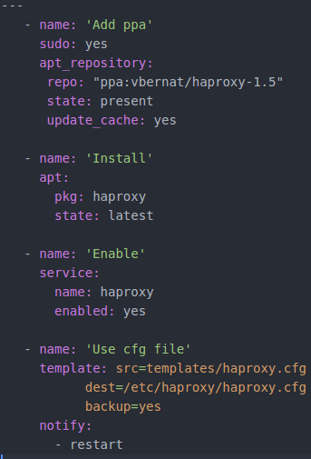
  - This add ppa to apt, install haproxy, enable it, and update the cfg file using the template in the Playbook
- `handlers/main.yml`:
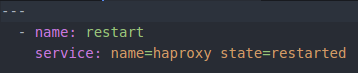
  - This restart haproxy after the cfg file has been updated
- `vars/main.yml`:
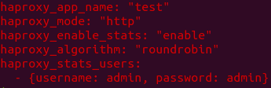
- `template/haproxy.cfg` is the same as the sample on moodle except for this block:
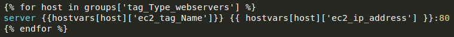
  - Here the variable references have been changed due to the use of `ec2 dynamic inventory`

Notes: haproxy `vars/main.yml` has been encrypted using ansible vault

### Makefile

A task runner is included for quick demo: 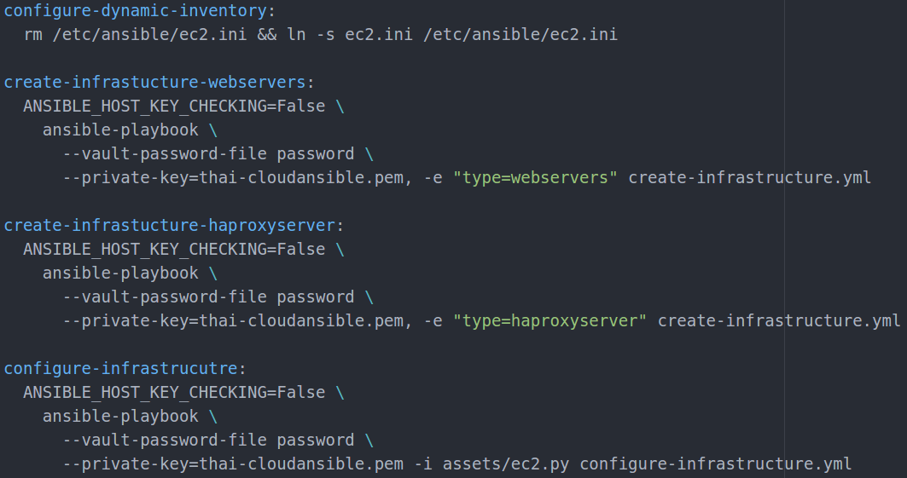

All ansible commands have the following:
- `ANSIBLE_HOST_KEY_CHECKING=False`: make ansible not to prompt using for adding public keys of any EC2 instance to known_hosts
- `--vault-password-file password`: required to decrypt haproxy `vars/main.yml`
- `--private-key=thai-cloudansible.pem`: so that ansible can configure the EC2 instances over SSH

# Demo

### Create 2 instances for nginx

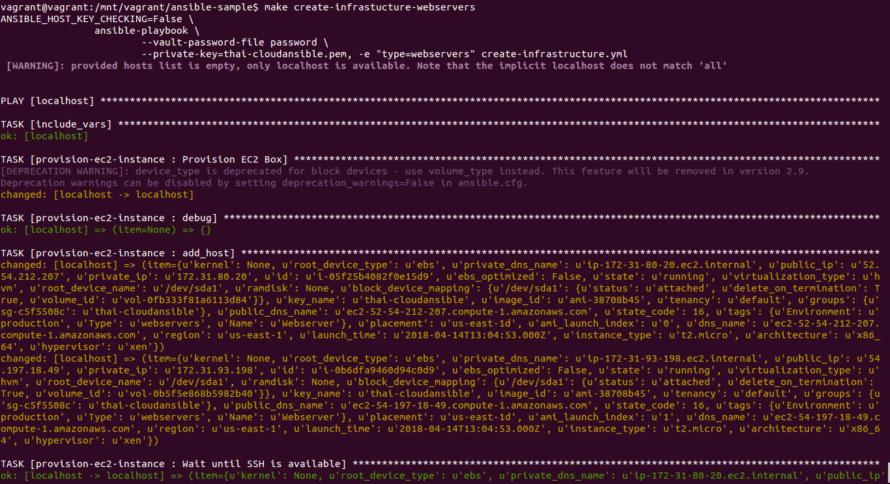

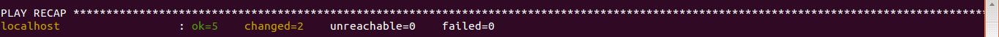

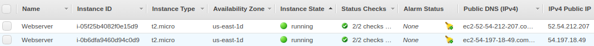

### Create 1 instance for haproxy

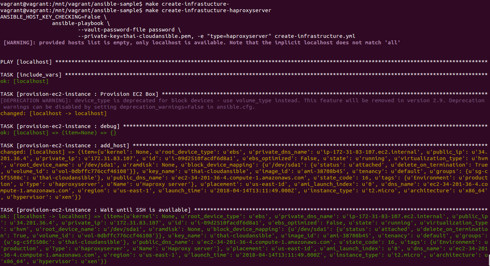

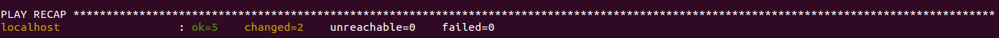

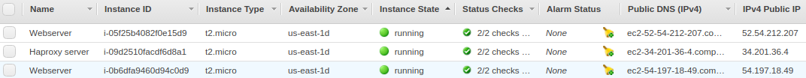

### Install and configure nginx and haproxy on the created instances

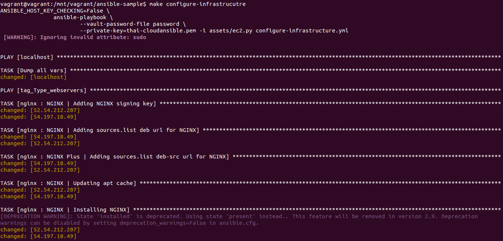

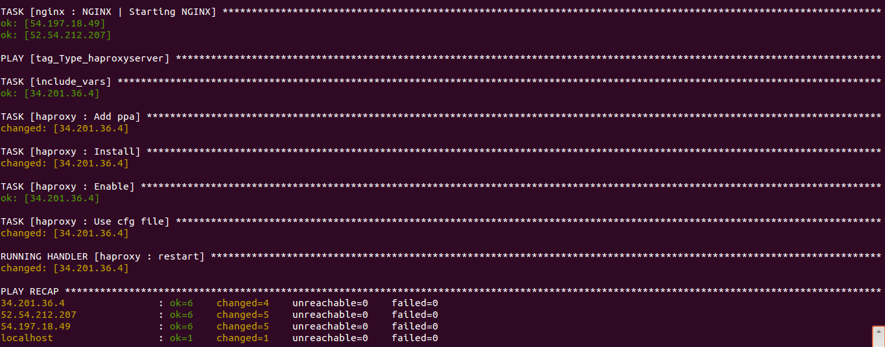

### Browse to the haproxy public ip

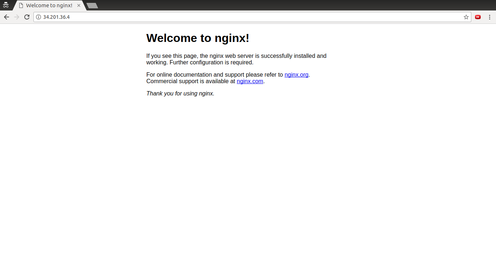

# Issues encountered

### Wrong disk

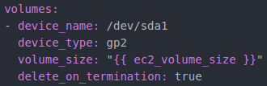

In the above configuration block that configures an ec2 instance. The `device_name` had been set to a device that the selected AMI does not have, which made the instance to be stopped immediately after it was created.

### SSH error of Ubuntu 16

Initially, the newest Ubuntu AMI was used. However, ssh connection established by ansible kept getting broken, and the way to fix it is to manually ssh to the new instance and install python on it. ( Suggested by https://github.com/ansible/ansible/issues/25941#issuecomment-376972056 )

Hence, Ubuntu 14 has been used instead

# Conclusion

Agentless and idempotency are important characteristics of Ansible that make it a powerful tool to configure infrastructures. When the instances have been created, no agent is required to be installed on them. However, the `provision-ec2-instance` role of the current state of this playbook is not idempotent, because every time `create-infrastructure.yml` is run, a new set of instances is created.
